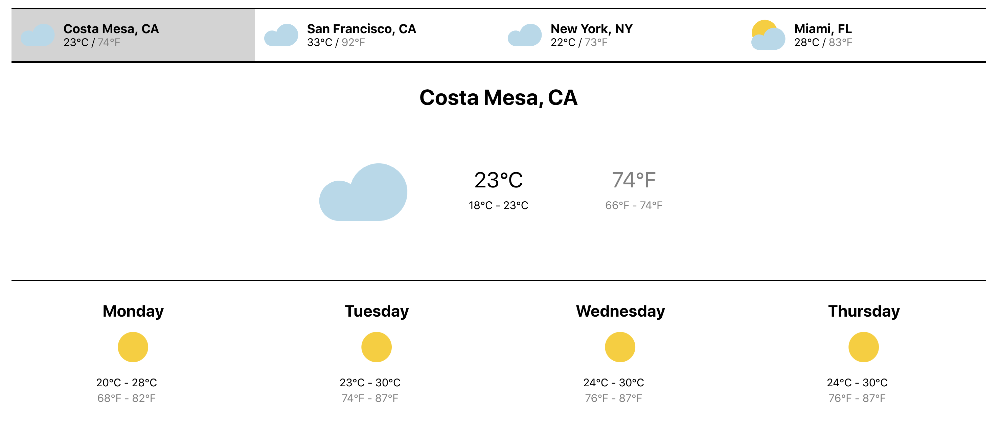

This project was bootstrapped with [Create React App](https://github.com/facebook/create-react-app).

# React Weather App

This weather app was built completely with the latest React technology. It utilizes React Hooks within functional components. React Context is used to share the current condition & forecast among components.
The data is aynchronously fetched from Open Weather Map on page load.

## Technologies

I used: 

- React Context API
- React Hooks
- Fetch requests
- CSS

 

